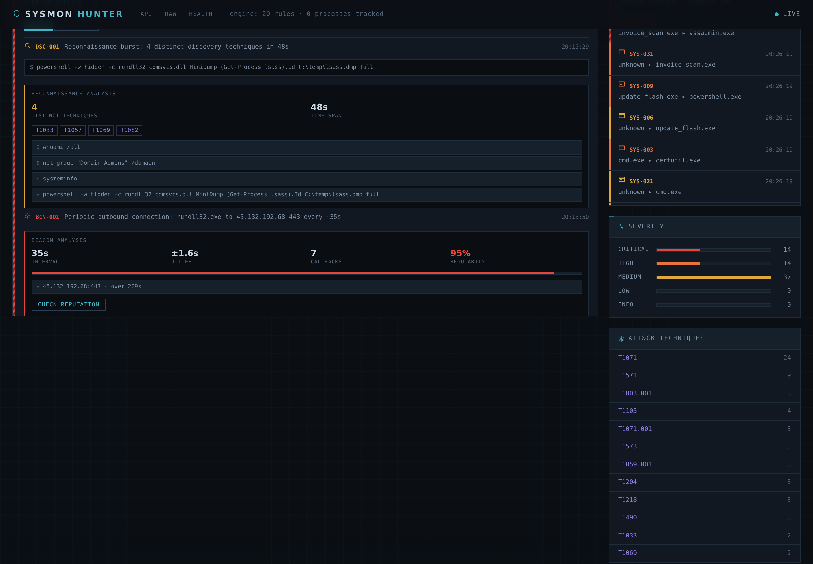
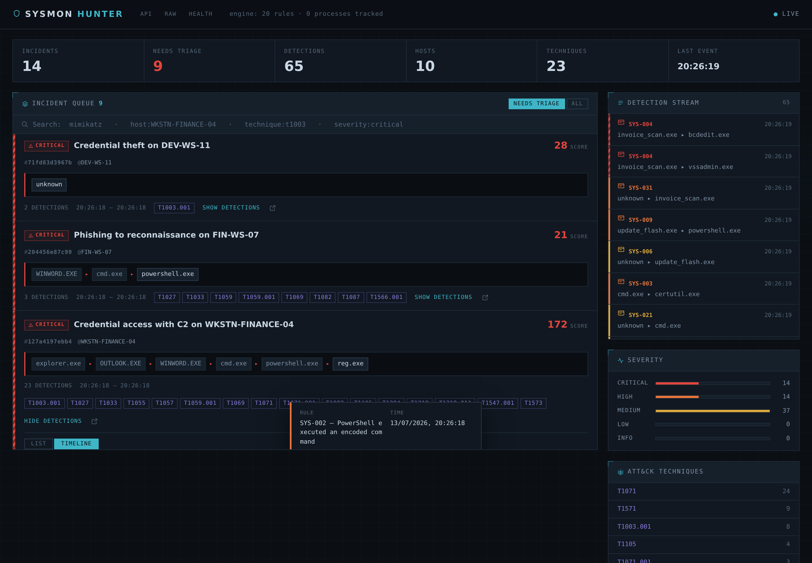
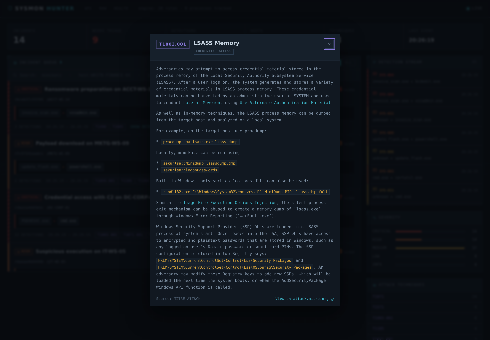
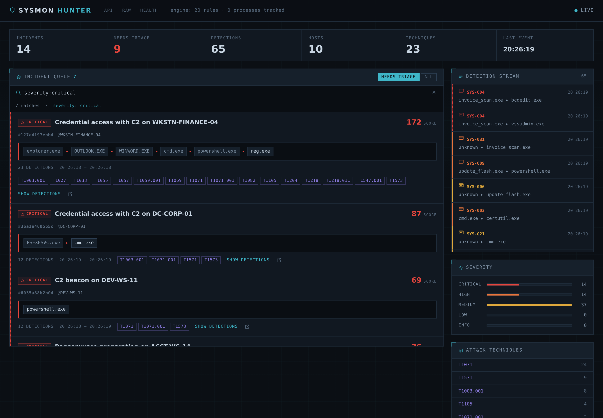

# Sysmon Hunter

A real-time detection and correlation engine for Windows Sysmon telemetry, with
a live analyst console. It ingests events from an endpoint, matches them against
ATT&CK-mapped rules, reconstructs the process tree to correlate related
detections into incidents, detects C2 beaconing statistically, and enriches
indicators against external reputation sources — all streamed to a dark SOC
console.

This is a detection-engineering project. The interesting part is not that it
matches rules, but *what it does with a match*. A lone "PowerShell ran an
encoded command" is a lead. The same detection sitting under a `WINWORD.EXE`
root, next to a recon burst and an outbound beacon, with a Mimikatz hash
confirmed malicious by VirusTotal, is an incident an analyst can act on now.


---

## What it does

- **Rule-based detection** — 20 YAML rules with Sigma-compatible matching
  semantics, mapped to MITRE ATT&CK, across 7 Sysmon event types (process
  creation, network, registry, image load, process access, file create, named
  pipes). Indexed by EventID so only relevant rules run per event.
- **Process-tree correlation** — reconstructs ancestry from Sysmon's
  `ProcessGuid`, so detections that share a root become one incident with the
  full chain: `WINWORD.EXE -> cmd.exe -> powershell.exe`.
- **Statistical beacon detection** — finds periodic C2 callbacks no single-event
  rule can see, robust to the jitter every modern C2 applies.
- **Reconnaissance-burst detection** — flags clusters of *distinct* ATT&CK
  discovery techniques in one process tree.
- **Derived incident titles** — each incident is named from its contents:
  "Phishing to reconnaissance", "Credential access with C2", "Ransomware
  preparation" — readable at a glance without expanding a row.
- **IOC enrichment** — IPs, domains and file hashes against AbuseIPDB and
  VirusTotal, on demand, cached, degrading gracefully with no API keys.
- **Live console** — WebSocket feed, incident queue, interactive attack timeline,
  clickable ATT&CK techniques with MITRE descriptions, full-page incident view,
  PDF reports, and search.

---

## The console

### Incident detail with process chain and forensics

Expanding an incident shows every detection, its command line, and the full
forensic context — who ran it, with what privileges, and the hashes for
pivoting.



### Interactive attack timeline

The timeline places each detection in sequence with the real time gap between
steps. Clicking a node opens a forensic detail popup: process, parent, user,
integrity level, hashes, and — for a binary — a one-click VirusTotal hash lookup.



### ATT&CK techniques, in context

Every technique chip opens its official MITRE description, fetched from a local
copy of the ATT&CK STIX dataset — no leaving the console to look up what
T1003.001 means.



### Search

One box for free text and field filters: `mimikatz`, `host:FIN-WS-07`,
`technique:t1003`, `severity:critical lsass`. An incident matches if any of its
detections — or its title and process chain — match.



---

## Pipeline

Every event, whatever produced it, takes one path:

```
              Winlogbeat / EVTX replay / seed script
                              |
                              v
                     POST /ingest  (thin: hands off, holds no logic)
                              |
                              v
         +--------------  Pipeline  --------------+
         v                                        |
   normalize()        Winlogbeat JSON -> Event    |
         |                                        |
         v                                        |
  ProcessTree.observe()  every event feeds the    |
         |               tree, not just suspicious |
         v                                        |
   +-----+-----+--------------+                    |
   v           v              v                    |
 rules   beacon detector  discovery detector       |
   |           |              |                    |
   +-----+-----+--------------+                    |
         v                                         |
  IncidentEngine.correlate()  group by tree root   |
         |                     within a time window |
         v                                         |
   persist (SQLite)  +  broadcast (WebSocket)       |
         +-----------------------------------------+
                              |
                              v
                      Analyst console
```

The pipeline is independent of HTTP. It runs identically under `/ingest`, the
EVTX replay script, and pytest with no server at all.

---

## Design decisions

The choices below are what separate this from a `grep` over event logs. Each is
enforced by a test named after it.

**Correlation keys on GUID, never PID.** Windows recycles process IDs
aggressively; a PID-keyed tree grafts a malicious child onto whatever unrelated
process inherited its parent's PID. Sysmon's `ProcessGuid` is unique across
reboots and PID reuse.

**The tree observes everything, not just detections.** A malicious process's
ancestors are all benign, so `WINWORD.EXE` — which never triggers a rule — must
still be recorded, or it never appears as the root of a phishing chain.

**Incident scoring is non-linear.** One LSASS access (critical, 14) outweighs
three suspicious-path executions (medium, 5 each). Two highs read as critical, so
an incident can be worse than any single rule that composes it.

**Beaconing uses median and MAD, not mean and standard deviation.** A live C2
session produces outliers constantly — the operator interacts, a callback retries
late. One 400-second gap in a 60-second beacon wrecks a standard-deviation score
and loses the channel; the median barely notices. Jitter up to Cobalt Strike's
default 37% is still caught.

**Discovery counts distinct techniques, not executions.** A script running
`systeminfo` on a loop is volume without variety; an attacker running whoami +
net + nltest + systeminfo is variety fast. Only the second is a burst.

**Enrichment works with no API keys, and never leaks internal data.** Every
provider degrades to "unavailable" without a key. Private IPs are never sent to a
third party. Hashes prefer SHA256 over MD5, since MD5 collisions are cheap enough
that malware authors produce them deliberately.

**One serializer, two paths.** The console loads history over REST and receives
live updates over WebSocket, both from a single serializer — so a rendered row
cannot tell which path it arrived on.

---

## Getting started

Requires Python 3.11+.

```bash
python -m venv .venv
source .venv/bin/activate            # Windows: .venv\Scripts\Activate.ps1
pip install -r requirements.txt

python -m alembic upgrade head       # create the database schema
python -m uvicorn backend.main:app --reload --host 0.0.0.0 --port 8000
```

- Console: <http://localhost:8000>
- API docs: <http://localhost:8000/api/docs>
- Health: <http://localhost:8000/health>

### See it populated

Two seed scripts fill the console with realistic incidents:

```bash
python scripts/seed_apt.py    # one deep multi-stage intrusion (score 172)
python scripts/seed_demo.py   # eight varied incidents across the kill chain
```

`seed_apt.py` builds a full intrusion on one host — phishing -> recon -> Mimikatz
(with real hashes) -> LSASS -> beacon -> persistence -> exfil — as a single
correlated incident with a deep process tree. `seed_demo.py` adds lateral
movement to a domain controller, an IIS web shell, browser credential theft, and
a complete ransomware sequence.

### Optional: IOC enrichment

Enrichment works without keys (every provider simply reports unavailable). For
live reputation, add free API keys to a `.env` file:

```
HUNTER_ABUSEIPDB_API_KEY=...    # https://www.abuseipdb.com/register
HUNTER_VIRUSTOTAL_API_KEY=...   # https://www.virustotal.com/gui/join-us
```

### Replay real telemetry

```bash
pip install evtx
python scripts/replay_evtx.py --file samples/lateral_movement.evtx
```

Point it at an `.evtx` from a lab VM or the
[EVTX-ATTACK-SAMPLES](https://github.com/sbousseaden/EVTX-ATTACK-SAMPLES) corpus,
where each file is one ATT&CK technique.

---

## Tests

```bash
pip install pytest pytest-asyncio
python -m pytest        # 163 tests
```

The suite is worth reading as documentation: each design decision above has a
test named for it. The negative tests in `test_beacon.py` — human browsing,
page-load bursts — are the ones that decide whether the beacon detector is usable
on a real network, and are where two real design bugs were caught during
development.

---

## Docker

```bash
docker compose up --build
```

Multi-stage build: the runtime image carries only the app and its virtualenv, not
the build tooling. Runs as an unprivileged user, self-migrates on start, and
health-checks `/health`. Rules are mounted read-only for hot-reload; the database
lives on a named volume across rebuilds.

---

## Project layout

```
sysmon-hunter/
├── backend/
│   ├── main.py              FastAPI app, lifespan, background sweep
│   ├── config.py            all tunables
│   ├── api/                 ingest, detections, incidents, attack, enrich,
│   │                        report, search, ws, serializers
│   ├── engine/              normalizer, rule_loader, matcher, correlator,
│   │                        beacon, discovery, attack, enrichment, search,
│   │                        report, pipeline
│   ├── models/              schemas, db
│   └── data/                attack_data.json (ATT&CK technique lookup)
├── rules/                   20 YAML detection rules, by EventID
├── frontend/                console.html, incident.html, static/{css,js}
├── migrations/              Alembic
├── scripts/                 seed_apt, seed_demo, replay_evtx, fetch_attack
├── docs/                    screenshots
└── tests/                   163 tests
```

---

## Lab setup

To generate live telemetry rather than replaying it:

- A Windows VM with [Sysmon](https://learn.microsoft.com/sysinternals/downloads/sysmon)
  and a config such as [SwiftOnSecurity's](https://github.com/SwiftOnSecurity/sysmon-config).
- [Winlogbeat](https://www.elastic.co/beats/winlogbeat) shipping the Sysmon
  channel to `POST /ingest`.
- [Atomic Red Team](https://github.com/redcanaryco/invoke-atomicredteam) to fire
  the ATT&CK technique behind each rule and confirm it triggers.

---

## Notes

Built as a hands-on threat-detection research project. The engine targets a
single collector; scaling to many would mean moving the queue to Redis and the
store to Postgres, both isolated behind small interfaces so that change touches
one file each.