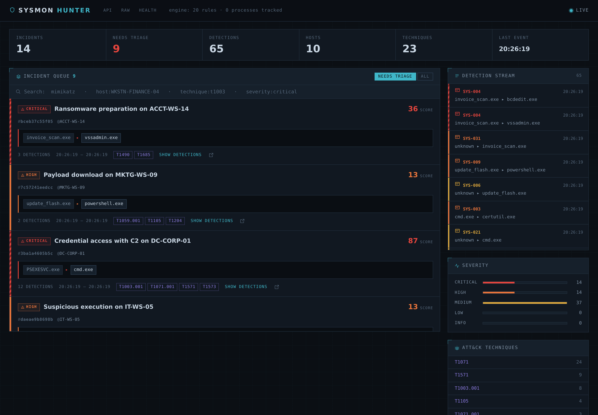
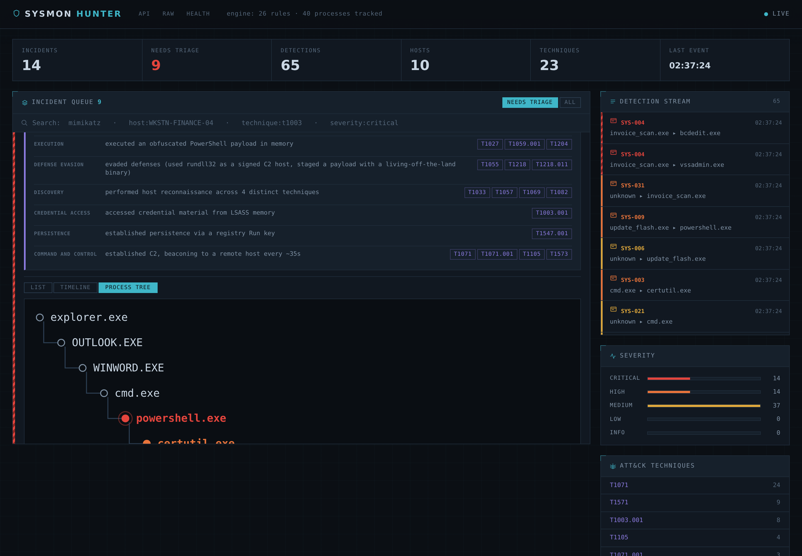
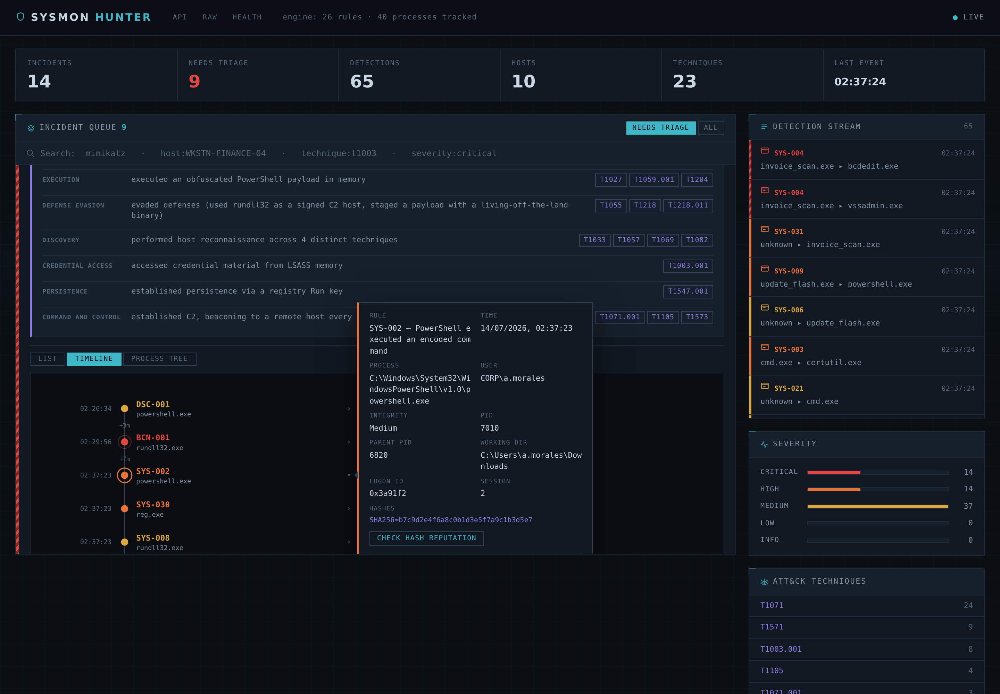
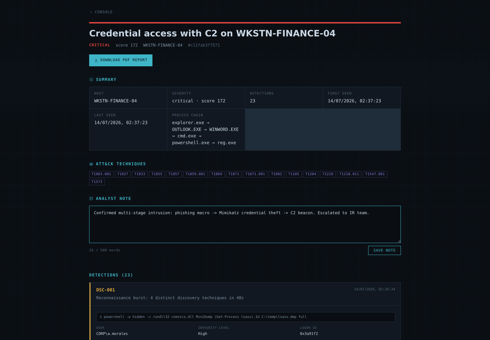

# Sysmon Hunter

**v0.3.4**

A real-time detection and correlation engine for Windows Sysmon telemetry, with
a live analyst console. It ingests events from an endpoint, matches them against
ATT&CK-mapped rules, reconstructs the process tree to correlate related
detections into incidents, detects C2 beaconing and ransomware activity
statistically, and enriches indicators against external reputation sources —
all streamed to a dark SOC console.

This is a detection-engineering project. The interesting part is not that it
matches rules, but *what it does with a match*. A lone "PowerShell ran an
encoded command" is a lead. The same detection sitting under a `WINWORD.EXE`
root, next to a recon burst and an outbound beacon, with a Mimikatz hash
confirmed malicious by VirusTotal, is an incident an analyst can act on now.

Every detection rule in this project was written and validated against real
malware telemetry — see [Detection engineering](#detection-engineering).



---

## Why this exists

Sysmon telemetry, by itself, is not a detection. A single event —
`powershell.exe -enc SQBFAFgA...` — is a lead an analyst has to chase by hand:
pull up the process tree, check what spawned it and what it spawned, check
whether the IP it beaconed to is known-bad, decide whether the ten minutes that
just cost was worth it. Multiply that by the volume a real endpoint produces and
the actual job of a SOC analyst is triage, not detection — deciding, fast, which
of a thousand events deserves the next five minutes.

This project exists to practice that whole job, not just the rule-writing part
of it. Most detection-engineering practice stops at "does this Sigma rule match
this sample" — a useful exercise, but it skips the part that decides whether an
analyst can actually act on the output: does a match become an incident with the
story around it, does the process tree survive to be shown, does one critical
detection outrank three medium ones the way it should, is a false positive one
click to dismiss instead of a database edit. Building the full pipeline —
ingest, normalize, correlate, score, present — was the point, and every rule in
the corpus is validated the way a real detection engineer validates one: replay
a known-bad `.evtx` from a public malware-sample corpus, see what fires and what
should have, fix the gap, prove the fix against the sample. [SYS-092](#detection-engineering)
exists because a submitted Emotet sample only tripped one rule in the whole
corpus — that gap, and how it got closed, is the kind of thing this project is
for.

The result is useful past the exercise. It runs as a single process on a
laptop's worth of resources, needs no SIEM license or cluster to stand up, and
turns a Sysmon event stream into a short queue of incidents that an analyst —
or someone learning what a detection pipeline looks like end to end — can
actually work through: what happened, in what order, how bad, and what to do
about it.

---

## What it does

- **Rule-based detection** — 149 YAML rules with Sigma-compatible matching
  semantics, mapped to MITRE ATT&CK, across all 23 Sysmon event types the
  engine understands (process creation, network, DNS query, registry create/
  delete/set/rename, image load, process access, remote thread, file create,
  file delete, file creation-time change, alternate data streams, named pipe
  created/connected, driver load, raw disk access, process tampering, Sysmon
  configuration change, clipboard capture, and all three WMI persistence
  events -- filter registration, consumer registration, and the binding
  between them). Indexed by EventID so only relevant rules run per event.
- **Ransomware detection** — a dropped ransom note (matched against the
  near-universal "how to decrypt / restore your files" naming convention) and
  mass file writes with a known ransomware encryption extension (`.locked`,
  `.encrypted`, `.crypt`, `.wcry`, and others), alongside the shadow-copy
  deletion and recovery-disabling commands that typically precede them.
- **ClickFix/FileFix detection** — four rules (SYS-151 through SYS-154)
  covering the clipboard-paste social-engineering technique: a decoy
  CAPTCHA-verification lure padded with a `#` comment, PowerShell launched
  from Explorer with both execution-policy bypass and a hidden window,
  a script host spawned from Explorer that immediately fetches remote code,
  and a second-stage PowerShell that pulls its real payload back out of the
  clipboard. Scoped to `parent_image = explorer.exe` where that is the
  technique's actual forensic tell (Run dialog and Explorer's address bar
  both produce it), since that is what separates a ClickFix paste from an
  administrator's identical-looking manual PowerShell session launched from
  a script or scheduled task.
- **RMM abuse and clipboard/screen collection** — four more rules
  (SYS-155 through SYS-158) closing gaps a coverage-report pass turned up:
  a remote-access tool (AnyDesk, TeamViewer, ScreenConnect, RustDesk, Atera,
  Splashtop, LogMeIn, Quick Assist) launched by something other than a
  user's own double-click, or installed with a silent/unattended flag —
  RMM software shows up in the large majority of 2024-2025 ransomware
  incidents specifically because it blends into normal IT traffic — plus a
  PowerShell clipboard-hijack pattern (crypto-clipper: read the clipboard,
  overwrite it before the victim pastes) and Problem Steps Recorder
  (`psr.exe`) abused for silent screenshot capture, a signed built-in LOLBAS
  technique with no third-party tool required.
- **Web-service C2 and data-staging detection** — four more rules
  (SYS-159 through SYS-162) from the same coverage-gap pass: a command line
  naming a Discord webhook, Telegram bot API, or Slack incoming webhook —
  free, disposable C2/exfil channels that terminate at a mainstream domain
  no egress filter blocks — a Pastebin/Gist raw dead-drop combined with a
  download-and-execute idiom, an archive tool packaging a whole Documents/
  Desktop/user-profile tree, and robocopy mass-mirroring one to a remote
  share — the bulk-collection step nearly every exfiltrate-then-encrypt
  ransomware playbook performs before anything actually leaves the host.
- **AD-specific detections** — six more rules (SYS-163 through SYS-168)
  closing the remaining, more domain-specific ATT&CK gaps: Rubeus `ptt`/
  `renew` and Mimikatz `sekurlsa::pth`/`kerberos::ptt` giving the correct
  pass-the-hash/pass-the-ticket tag alongside the existing generic
  rubeus.exe and Mimikatz-module-signature rules (deliberate overlap, not
  duplication — the same pattern SYS-118/SYS-150 already use), SharpGPOAbuse
  and PowerSploit's `New-GPOImmediateTask`/`Set-GPPrefRegistryValue` for GPO
  abuse, `netdom trust` with SID-filtering explicitly disabled
  (`/quarantine:no` or `/EnableSIDHistory:yes`) as a domain-trust
  privilege-escalation bridge, a silent unattended `format /y` or a forced
  recursive wipe of a broad user directory as destruction-for-its-own-sake,
  and a bulk `Get-ADUser -Filter | Disable-ADAccount` one-liner as the mass
  account lockout that often closes out a ransomware operation.
- **Cloud, SSH, WMI, and DCOM detections** — six more rules (SYS-169 through
  SYS-174) for gaps genuinely out of the mainstream but still detectable
  from Windows Sysmon telemetry alone: a script interpreter staging a copy
  of an AWS/Azure/gcloud CLI credential file, a Docker config, or a
  Kubernetes config; a curl/PowerShell request to the cloud instance
  metadata address (`169.254.169.254`) that every AWS/Azure/GCP instance
  exposes IAM credentials on with no authentication required, the same
  pivot the 2019 Capital One breach depended on; a staged SSH or PuTTY
  private key; `wmic process call create` or PowerShell's
  `Invoke-CimMethod`/`Invoke-WmiMethod` against `Win32_Process` — the
  decades-old fileless remote-execution primitive Impacket's wmiexec.py
  and Cobalt Strike both still use; `mmc.exe` spawning a shell, the
  signature of MMC20.Application DCOM lateral movement; and
  `docker run --privileged`, a container-escape precursor. Closing this
  batch also surfaced and fixed a real gap from the previous rule batch:
  the privilege-escalation tactic (added for the GPO-abuse rules) resolved
  correctly but was silently dropped from both the incident title fallback
  and the kill-chain narrative, since neither had a slot for it yet.
- **Persistence, credential-access, and lateral-movement detections** —
  16 more rules (SYS-175 through SYS-190) from a fresh gap survey against
  the live rule corpus: a script interpreter overwriting the sticky-keys
  accessibility binary directly (SYS-032 already catches the IFEO-registry
  variant of the same technique, this catches the file-replacement one);
  Winlogon Helper DLL, Security Support Provider, and Active Setup
  registry persistence; a domain account created directly rather than
  local; a Safe Mode boot (`bcdedit /set safeboot`) staged ahead of a
  ransomware run, the same trick that lets an encryptor start before
  security tooling that does not load in Safe Mode does; the Windows
  Event Log service or a specific channel disabled; an ISO/IMG mounted
  via `Mount-DiskImage` — the dominant phishing delivery pattern since
  Windows stopped propagating Mark-of-the-Web into a mounted image's
  contents; Mimikatz dumping LSA secrets or cached domain credentials and
  forging a Kerberos golden ticket; a file written with a double
  extension masking an executable; a plaintext autologon password
  queried from the registry; Group Policy Preferences `cpassword`
  harvested via the still-unpatched MS14-025 weakness; SSH lateral
  movement with a staged private key (SYS-171's staging step given a
  companion usage-side rule); Tor or another multi-hop anonymizing
  proxy; and a fileless archive staged through PowerShell's
  `System.IO.Compression` with no 7-Zip/WinRAR ever touching disk. Fixing
  these rules up also corrected a real narrative bug: the kill-chain
  summary's credential-access phrase was hard-coded to always claim
  "accessed credential material from LSASS memory," which would have
  misdescribed every one of the new registry-, GPP-, and ticket-based
  findings above — it now branches on which technique actually fired.
- **Full Sysmon EventID coverage** — 6 more rules (SYS-191 through SYS-196)
  closing the last EventIDs the engine understood but had zero rules on: a
  Sysmon configuration reload (`sysmon -c`), the strongest single signal that
  someone is trying to blind the sensor itself, since this event has no
  legitimate steady-state traffic to tune around; a WMI event filter
  registered and a filter-to-consumer binding created, completing the WMI
  persistence chain alongside the existing consumer-registration rule
  (SYS-071); a named-pipe *connection* matching the same Cobalt Strike/
  PsExec signatures already caught at pipe *creation* (SYS-060, SYS-072) —
  distinct because a machine on the receiving end of remote lateral movement
  can see the connection without ever having seen a local create; clipboard
  access from a scripting engine or LOLBIN rather than the foreground app,
  catching what the corpus's two command-line-based clipboard rules
  (SYS-154, SYS-157) cannot: a compiled crypto-clipper calling the Win32
  clipboard API directly, no PowerShell involved; and a persistence-relevant
  registry key renamed rather than created, set, or deleted, dodging every
  detection keyed only on those three operations.
- **Process-tree correlation** — reconstructs ancestry from Sysmon's
  `ProcessGuid`, so detections that share a root become one incident with the
  full branching tree.
- **Statistical beacon detection** — finds periodic C2 callbacks no single-event
  rule can see, robust to the jitter every modern C2 applies.
- **Reconnaissance-burst detection** — flags clusters of *distinct* ATT&CK
  discovery techniques in one process tree.
- **Behavior profiling** — turns an incident's detections into a kill-chain
  narrative: "gained initial access through a phishing document, executed an
  obfuscated PowerShell payload, harvested credentials from LSASS, beaconed to
  C2 every ~35s."
- **Derived incident titles** — each incident is named from its contents:
  "Phishing to reconnaissance", "Credential access with C2", "Ransomware
  preparation".
- **Correlation chains** — three named, rule-ID-level patterns
  (`_CORRELATION_CHAINS` in `backend/models/schemas.py`) recognise a specific
  multi-stage story — a ransomware activity chain, a credential-theft
  campaign, an Office-to-PowerShell infection chain — and outrank the
  tactic-based titles above when they match, surfaced as both the incident
  title and a `classification` badge in the console and the incident page.
- **IOC enrichment** — IPs, domains and file hashes against AbuseIPDB and
  VirusTotal, on demand, cached, degrading gracefully with no API keys.
- **Analyst notes** — a free-text note per incident (500-word limit), on its
  full-page view.
- **Full-text and field search** — one search box, free text plus
  `host:` / `severity:` / `technique:` / `rule:` / `user:` / `command_line:` /
  `actionable:` filters, mixed freely in a single query, with an on-demand "?"
  reference popover for the syntax.
- **PDF incident reports** — a self-contained, print-ready report per incident
  (summary, kill-chain narrative, process chain, every detection's forensics,
  and key indicators), generated server-side with no headless browser.
- **Incident triage** — close an incident, reopen it, or mark it a false
  positive from the console or its full-page view, through a "Set verdict"
  menu. Closed and false-positive incidents drop out of the default "needs
  triage" filter without disappearing from "all" or "closed".
- **False-positive similarity** — every incident an analyst marks a false
  positive becomes a labeled example (`backend/engine/noise.py`): the next
  open incident is compared against that history on four explainable
  signals — shared detection rules, shared ATT&CK techniques, the same root
  process, and process-chain overlap, weighted in that order — and a match
  above threshold (`HUNTER_NOISE_SIMILARITY_THRESHOLD`, default 0.6) surfaces
  a dashed "probable noise · NN%" badge naming exactly which past incident it
  resembles and why, in both the console queue and the incident page. Not a
  classifier and never auto-dismisses anything — it starts working from the
  very first false positive an analyst marks, with a score an analyst can
  audit down to the arithmetic that produced it.
- **Explore view** — a dedicated full-screen page per incident: a pan-and-zoom
  process tree, an equally full-screen timeline, and a plain scrollable log of
  every detection's full forensic detail — for a tree or sequence too wide or
  deep for the inline column, or an incident you just want to read straight
  through.
- **Live console** — WebSocket feed, incident queue, three inline incident
  views (list, interactive timeline, full process tree), clickable ATT&CK
  techniques with MITRE descriptions, inline base64 decoding of encoded
  command lines, a light/dark theme toggle, and a database-reset control, all
  in the settings menu.
- **Sigma rule import** — upload one or more Sigma YAML files from the
  settings menu (`POST /admin/rules/import-sigma`) and they convert straight
  into this engine's own rule schema and go live immediately, no restart.
  `backend/engine/sigma_import.py` supports the subset of Sigma that maps
  cleanly onto the matcher's flat field-spec model — Sysmon logsource
  categories, `and`/`or`/`1 of x*`/`all of x*` conditions, one trailing
  `and not <filter>`, the `contains`/`startswith`/`endswith`/`re` modifiers,
  and automatic glob-to-operator translation for bare wildcard values — and
  rejects anything richer (nested boolean groups, aggregations, unsupported
  modifiers) with the specific reason, per rule, rather than importing it
  wrong. Accepted rules are written under `rules/imported_sigma/` alongside
  the hand-written corpus.
- **STIX 2.1 export** — download any incident as a STIX bundle
  (`GET /incidents/{id}/stix`, next to the PDF report button) for another
  threat-intel platform to ingest. `backend/engine/stix_export.py` builds an
  `identity`, one `attack-pattern` per ATT&CK technique the incident's
  detections carry, one `indicator` per pivotable IOC already surfaced by
  `engine/indicators.py` (C2 destination IP/domain, file SHA256, persistence
  registry key — deduplicated across detections), and a `report` object
  tying it all together with the incident's title and behavior-profile
  narrative. Object IDs are deterministic (content-seeded UUIDv5, not
  random), so the same technique or the same incident always maps to the
  same STIX ID across exports, letting a receiving platform de-duplicate on
  import instead of accumulating copies. No relationship objects are
  invented between indicators and techniques — the source data is
  incident-level, not per-IOC, so claiming that precision would be STIX-
  shaped noise, not signal.
- **ATT&CK coverage report and Navigator export** — a settings-menu download
  (`GET /attack/coverage/navigator`) that renders every ATT&CK technique this
  project can detect — the rule corpus plus the two statistical detectors —
  as a MITRE ATT&CK Navigator layer, colored red (no coverage) through green
  (several rules), so opening it at
  [mitre-attack.github.io/attack-navigator](https://mitre-attack.github.io/attack-navigator/)
  is a prioritized worklist for the next rule to write, not just a tally of
  what already exists. `backend/engine/coverage.py` reads the small,
  always-committed `backend/data/attack_data.json` for covered techniques,
  and, when present, the full-catalog `backend/data/attack_index.json`
  (also written by `scripts/fetch_attack.py`) for every technique this
  project has *no* rule for — the true gap analysis `attack_data.json` alone
  cannot show, since it only ever contained what was already referenced.
  Without the index file the report still works, just partially: it degrades
  to ranking covered techniques against each other rather than refusing to
  run. The underlying JSON report is also available directly at
  `GET /attack/coverage`.
- **Production hardening** — a Prometheus text-exposition scrape target at
  `GET /metrics` (`backend/engine/metrics.py`, hand-rolled Counter/Histogram,
  no `prometheus_client` dependency) reporting ingest outcomes, detections by
  rule ID, HTTP request counts and latency by route, and every `/health`
  gauge under a `hunter_` prefix; structured single-line JSON logging via
  `HUNTER_LOG_JSON=true` (`backend/logging_setup.py`) for log aggregators
  that expect one parseable record per line instead of the human-readable
  text format kept as the default; and an opt-in token-bucket rate limiter
  on `/ingest` (`HUNTER_INGEST_RATE_LIMIT_PER_SECOND`, 0 = disabled by
  default) so a single collector reachable from an untrusted network can be
  throttled without touching every other router. All three follow the same
  "off by default, opt-in via settings" shape `HUNTER_API_KEY` already
  established — a fresh checkout behaves exactly as it always did.
- **Stats dashboard** — a fourth console view (`GET /dashboard`, next to the
  console, incident page, and Explore) charting the whole rule corpus's
  behavior over time: incidents per day (7/14/30/90-day range, zero-filled
  so a quiet day is a visible flat bar, not a gap), severity distribution,
  triage status breakdown, and the top 10 rules and top 10 ATT&CK
  techniques by detection count, each technique linking straight to its
  MITRE page. Backed by `GET /stats` (`backend/engine/stats.py`), which
  reads the narrow column set it needs from SQLite and tallies it in
  Python rather than fighting SQLite into a "group by calendar day" it has
  no clean way to express. Rendered as plain HTML/CSS bar charts — no
  charting library, the same zero-new-dependency approach as everything
  else in the frontend.
- **Security hardening** — five fixes from a self-audit, closing gaps a
  network- or upload-reachable attacker (not just a rule author) could
  otherwise use: `/ws` now requires the same shared secret as every JSON
  router when `HUNTER_API_KEY` is set, carried as a `?key=` query parameter
  since a WebSocket handshake cannot send a custom header; a Sigma-imported
  rule's `|re` field is validated by `backend/engine/redos_guard.py` (a
  length cap, a nested-quantifier heuristic, and an empirical timing probe
  run in a throwaway subprocess) before it can reach the matcher's hot path,
  since a catastrophic-backtracking pattern accepted there would run against
  every event ingested from then on; the IOC-enrichment popup escapes the
  provider link before inserting it into an `href` attribute, closing a
  latent XSS path for any future indicator source that is not as
  structurally constrained as today's IP/hash pair; the `/ingest` rate
  limiter's per-IP bucket dict is now LRU-capped so an attacker rotating
  source IPs cannot grow it without bound — the exact scenario the limiter
  exists for; and `/ingest` enforces a byte cap while streaming the request
  body, rather than buffering an unbounded POST into memory before rejecting
  it.

---

## The console

### Incident detail: behavior profile and process tree

Expanding an incident leads with a plain-language behavior profile — what
happened, phase by phase, each line backed by the ATT&CK techniques behind it —
then the complete branching process tree the incident spans. A foothold that
spawned several children shows every branch; nodes that fired a detection are
coloured by severity, benign context processes are hollow.



"Explore" hands the same incident to a dedicated full-screen page — process
tree, timeline, and a plain scrollable log, each a click away from the other —
with the tree and timeline gaining click-and-drag panning, scroll-wheel zoom,
and zoom-to-fit, built for a wide or deep tree, or a long sequence, that the
inline column cannot show at once.

### Interactive attack timeline

The timeline places each detection in sequence with the real time gap between
steps. Clicking a node opens a forensic popup: process, parent, user, integrity
level, hashes, and — for a binary — a one-click VirusTotal hash lookup.



### Full-page incident view with analyst notes

Each incident has a dedicated page with a summary, ATT&CK techniques, a
plain-text analyst note (500-word limit), and every detection with forensics and
a base64 decode button for encoded command lines.



### ATT&CK techniques in context

Every technique chip opens its official MITRE description, from a local copy of
the ATT&CK STIX dataset — no leaving the console to look up what T1003.001 means.


---

## Pipeline

Every event, whatever produced it, takes one path:

```
              Winlogbeat / EVTX replay / seed script
                              |
                              v
                     POST /ingest  (thin: hands off, holds no logic)
                              |
                              v
         +--------------  Pipeline  --------------+
         v                                        |
   normalize()        Winlogbeat JSON -> Event    |
         |                                        |
         v                                        |
  ProcessTree.observe()  every event feeds the    |
         |               tree, not just suspicious |
         v                                        |
   +-----+-----+--------------+                    |
   v           v              v                    |
 rules   beacon detector  discovery detector       |
   |           |              |                    |
   +-----+-----+--------------+                    |
         v                                         |
  IncidentEngine.correlate()  group by tree root   |
         |                     within a time window |
         v                                         |
   persist (SQLite)  +  broadcast (WebSocket)       |
         +-----------------------------------------+
                              |
                              v
                      Analyst console
```

The pipeline is independent of HTTP. It runs identically under `/ingest`, the
EVTX replay script, and pytest with no server at all.

---

## Detection engineering

Every rule in the corpus was written and validated against real malware
telemetry, not synthetic fixtures. The workflow, repeated for each sample:
replay a known-bad `.evtx`, find what fires (or doesn't), analyse the gap, write
the rule, and validate it against the sample — true positives fire, legitimate
activity stays quiet.

Rules built this way from real samples include:

- **Ostap loader** (`.cpl` disguised as an invoice → encoded JScript): a control
  panel item run from a user-writable path, an encoded script host, and a script
  host spawned by rundll32.
- **WinPwnage** (`rundll32 url.dll,OpenURL` / `FileProtocolHandler`): a LOLBAS
  execution technique that runs payloads through the shell's protocol handlers.
- **IIS credential discovery** (`appcmd list apppool /text:processmodel.password`):
  dumping application-pool credentials in plaintext.
- **FTP LOLBAS execution** (`ftp.exe -s:script`): a built-in Windows binary
  running an arbitrary script file to move data or execute commands.
- **WMI-actor registry persistence**: a Run key written by `WmiPrvSE.exe`,
  the WMI provider host — a favored way to plant persistence without a
  suspicious parent process.

Detections whose evidence is a file, not a process, get the same forensic
treatment: SYS-080 (ransom note dropped) and SYS-081 (ransomware-extension
write) surface the exact matched file path — the ransom note's location, or
each `.locked` file — everywhere a detection's detail is shown, since a
file-write detection has no command line to fall back on.

The same process surfaced a normalizer bug: EventID 8/10 name the acting process
with `Source*` fields, not `Image`/`ProcessGuid` — so credential-dumping and
injection detections were not capturing *who* did it. Fixed and tested.

A later pass replayed 166 real "sysmon"-named samples from the
[EVTX-ATTACK-SAMPLES](https://github.com/sbousseaden/EVTX-ATTACK-SAMPLES)
corpus against the full rule set and added ten more rules for the gaps that
surfaced: LSASS dumping via `comsvcs.dll`'s MiniDump export, the fileless
UAC-bypass registry hijack behind fodhelper/sdclt/eventvwr-style techniques,
CMSTP silent execution, `netsh` port forwarding, PowerShell logging tampering
(script block logging and Constrained Language Mode), an IIS worker process
or SQL Server spawning a shell, PowerShell-remoting child processes, and
direct SAM-hive account/group manipulation. The same pass caught a rule that
had never fired against real telemetry: SYS-071's WMI event-consumer check
compared `Type` against the WMI class name, but Sysmon actually reports the
human-readable label ("Command Line", "Script") — fixed and validated against
two real captures.

A user-submitted Emotet sample (`exec_emotet_sysmon_1.evtx`) surfaced one more
gap: the sample is a single process-creation event, and it only tripped
SYS-006 (execution from a staging path). The payload's PE metadata claimed
`CALC.EXE` / "Windows Calculator" / Microsoft Corporation while running under a
random name from a Temp folder — classic resource-spoofing, and a signal no
rule inspected, since the existing masquerading rule (SYS-007) only checks
whether the *file itself* is named after a system binary. **SYS-092** checks
`OriginalFileName` against a list of commonly-spoofed binaries alongside the
staging-path check, and is validated against the same sample.

A separate pass added 15 more rules (SYS-093 through SYS-107) not from a
specific captured sample but to close gaps in technique coverage that had no
rule at all: scheduled-task creation, a new service pointed at a staged
binary, a remote thread created inside LSASS (the injection route to the same
target SYS-041 already covers by memory access), a firewall rule opened for
inbound traffic, an event log cleared with `wevtutil`, a passworded archive
staged for exfiltration, `InstallUtil`/`Regsvcs`/`Regasm` run against a staged
assembly, a remote HTA or MSI package, `hh.exe` against a staged `.chm`, an
account added to local Administrators from the command line, a security
service stopped, anti-forensic disk wiping (`sdelete`, `cipher /w`), and RDP
enabled via registry. A second pass added 16 more (SYS-108 through SYS-123):
SAM/SYSTEM/SECURITY hive dumps via `reg save`, procdump against LSASS,
NTDS.dit extraction via `ntdsutil`, `mavinject` injection, WSL used as a
LOLBIN, MSBuild against a staged project, four more staged-target LOLBAS
launchers, an RDP session hijack via `tscon`, direct execution of AD-recon
tooling (SharpHound/AdFind), cloud-exfil tools (rclone/mega), Kerberoasting
via Rubeus, a PowerShell v2 downgrade, an AMSI-bypass command-line signature,
classic `bitsadmin /transfer`, a COM CLSID hijack, and token-theft tool
keywords. A third pass added 8 more (SYS-124 through SYS-131), this time
targeting Sysmon event types the corpus had never keyed on at all: a DNS
query to a dynamic-DNS domain, an executable deleted from a staging path
right after it ran, process hollowing/doppelganging, a payload staged inside
an NTFS alternate data stream, raw volume access outside known disk
utilities, a backdated file-creation timestamp, a DCSync-style directory
replication request, and a command line naming a specific Mimikatz module.
A fourth pass added 15 more (SYS-132 through SYS-150, skipping a few numbers
left unused by design): `odbcconf`/`mmc` signed-binary proxy execution,
browser-credential and KeePass database staging (by process identity and by
staging path, two separate rules on purpose), network/connection/directory
discovery via built-in commands, a command line that both enumerates
processes and names a security vendor, archive creation with its header
encrypted (not just password-protected), a `curl -T`/`Invoke-WebRequest
-InFile` upload, an `rclone` transfer against an actual configured remote,
script-based SharpHound invocation, built-in AD account/group enumeration
commands, and Impacket-style AS-REP roasting. This pass also introduced
**correlation chains**: three named, rule-ID-level patterns
(`_CORRELATION_CHAINS` in `backend/models/schemas.py`) that recognise a
specific multi-stage story — a ransomware activity chain, a credential-theft
campaign, and an Office-to-PowerShell infection chain — and surface it as a
`classification` field and a chain-specific incident title, ranked above the
existing tactic-based narratives. Every rule across all four passes ships
with a true-positive and a true-negative case; `scripts/seed_full_coverage.py`
fires all 149 end to end as a single correlated incident and confirms its
classification.

---

## Design decisions

The choices below are what separate this from a `grep` over event logs. Each is
enforced by a test named after it.

**Correlation keys on GUID, never PID.** Windows recycles process IDs
aggressively; a PID-keyed tree grafts a malicious child onto whatever unrelated
process inherited its parent's PID. Sysmon's `ProcessGuid` is unique across
reboots and PID reuse.

**The tree observes everything, not just detections.** A malicious process's
ancestors are all benign, so `WINWORD.EXE` — which never triggers a rule — must
still be recorded, or it never appears as the root of a phishing chain.

**Incident scoring is non-linear.** One LSASS access (critical, 14) outweighs
three suspicious-path executions (medium, 5 each). Two highs read as critical, so
an incident can be worse than any single rule that composes it.

**Beaconing uses median and MAD, not mean and standard deviation.** A live C2
session produces outliers constantly — the operator interacts, a callback retries
late. One 400-second gap in a 60-second beacon wrecks a standard-deviation score
and loses the channel; the median barely notices. Jitter up to Cobalt Strike's
default 37% is still caught.

**Discovery counts distinct techniques, not executions.** A script running
`systeminfo` on a loop is volume without variety; an attacker running whoami +
net + nltest + systeminfo is variety fast. Only the second is a burst.

**Enrichment works with no API keys, and never leaks internal data.** Every
provider degrades to "unavailable" without a key. Private IPs are never sent to a
third party. Hashes prefer SHA256 over MD5, since MD5 collisions are cheap enough
that malware authors produce them deliberately.

---

## Getting started

Requires Python 3.11+.

```bash
python -m venv .venv
source .venv/bin/activate            # Windows: .venv\Scripts\Activate.ps1
pip install -r requirements.txt

python -m alembic upgrade head       # create the database schema
python -m uvicorn backend.main:app --reload --host 0.0.0.0 --port 8000
```

- Console: <http://localhost:8000>
- API docs: <http://localhost:8000/api/docs>

### See it populated

```bash
python scripts/seed_apt.py    # one deep multi-stage intrusion (score 172)
python scripts/seed_demo.py   # varied incidents across the kill chain
python scripts/seed_rw.py     # a full ransomware chain in one incident
```

### Analyse a real sample

Replay a Sysmon `.evtx` — from a lab VM, or the
[EVTX-ATTACK-SAMPLES](https://github.com/sbousseaden/EVTX-ATTACK-SAMPLES) corpus,
where each file is one ATT&CK technique:

```bash
pip install evtx
python scripts/replay_evtx.py --file samples/sysmon_credential_access.evtx
```

### Optional: IOC enrichment

Works without keys (every provider reports unavailable). For live reputation,
add free API keys to a `.env` file:

```
HUNTER_ABUSEIPDB_API_KEY=...    # https://www.abuseipdb.com/register
HUNTER_VIRUSTOTAL_API_KEY=...   # https://www.virustotal.com/gui/join-us
```

### Optional: API key

The server binds `0.0.0.0` by default, so it's reachable from anywhere on the
network it runs on. With no key set, that's fine for a single trusted
network. If it's reachable more broadly than that, set a shared secret and
every JSON endpoint (not the console's own pages) starts requiring a matching
`X-API-Key` header — see `backend/api/auth.py`.

Generate one (any of these produce a suitably long random string — pick
whichever tool you already have):

```bash
# Cross-platform, no extra dependency (Python is already required)
python -c "import secrets; print(secrets.token_hex(32))"

# Linux / macOS
openssl rand -hex 32
```

```powershell
# Windows PowerShell
-join ((1..32) | ForEach-Object { '{0:x2}' -f (Get-Random -Maximum 256) })
```

Then add it to your `.env` file:

```
HUNTER_API_KEY=<paste the generated string here>
```

(Running under Docker Compose instead? Set it under `environment:` in
`docker-compose.yml` the same way `HUNTER_DB_URL` is set there.)

The console detects a `401` on its own and prompts once for the key, then
remembers it in the browser for next time — no other setup needed. The key
travels as a plain header, not a secret exchange, so treat it like a
password: don't commit it, and prefer HTTPS (e.g. behind a reverse proxy) if
the server is reachable outside a network you trust.

### Optional: production hardening

Three more knobs, all off by default so a fresh checkout is unaffected:

```
HUNTER_LOG_JSON=true                        # one JSON object per log line, for log aggregators
HUNTER_INGEST_RATE_LIMIT_PER_SECOND=10      # 0 (default) disables the limiter entirely
HUNTER_INGEST_RATE_LIMIT_BURST=50           # tokens a client can spend in a burst before throttling
```

`GET /metrics` is always on and unauthenticated (same precedent as `/health`)
— point Prometheus, Grafana Agent, or any compatible scraper at it. It
reports every `/health` gauge under a `hunter_` prefix, plus request counts
and latency histograms by route and detections raised by rule ID.

---

## Tests

```bash
pip install pytest pytest-asyncio
python -m pytest        # 674 tests
```

The suite doubles as documentation: each design decision has a test named for
it, and every shipped rule is validated against a true positive it must catch
and a true negative it must ignore.

---

## Docker

```bash
docker compose up --build
```

Multi-stage build: the runtime image carries only the app and its virtualenv, not
the build tooling. Runs as an unprivileged user, self-migrates on start, and
health-checks `/health`.

---

## Project layout

```
sysmon-hunter/
├── backend/
│   ├── main.py              FastAPI app, lifespan, background sweep, /metrics
│   ├── config.py            all tunables
│   ├── logging_setup.py     text/JSON log formatting
│   ├── api/                 ingest, detections, incidents, attack, enrich,
│   │                        report, search, notes, admin, ws, serializers,
│   │                        rate_limit, stats
│   ├── engine/              normalizer, rule_loader, matcher, correlator,
│   │                        beacon, discovery, attack, coverage,
│   │                        enrichment, search, report, profile, pipeline,
│   │                        sigma_import, redos_guard, stix_export, noise,
│   │                        metrics, stats
│   ├── models/              schemas, db
│   └── data/                attack_data.json (ATT&CK technique lookup),
│                            attack_index.json (full catalog, coverage gaps)
├── rules/                   149 YAML detection rules, by EventID, plus
│                            imported_sigma/ for rules imported at runtime
├── frontend/                console.html, incident.html, tree.html,
│                            dashboard.html, static/{css,js}
├── migrations/              Alembic
├── scripts/                 seed_apt, seed_demo, seed_rw, seed_full_coverage,
│                            replay_evtx, fetch_attack
├── docs/                    screenshots
└── tests/                   674 tests
```

---

## Notes

Built as a hands-on threat-detection research project. The engine targets a
single collector; scaling to many would mean moving the queue to Redis and the
store to Postgres, both isolated behind small interfaces so that change touches
one file each.

---

## License

[MIT](LICENSE)
