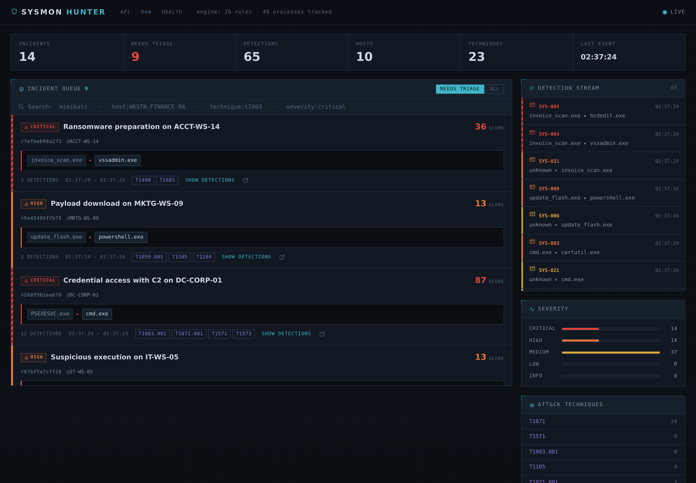

# Sysmon Hunter

**v0.2.0**

A real-time detection and correlation engine for Windows Sysmon telemetry, with
a live analyst console. It ingests events from an endpoint, matches them against
ATT&CK-mapped rules, reconstructs the process tree to correlate related
detections into incidents, detects C2 beaconing and ransomware activity
statistically, and enriches indicators against external reputation sources —
all streamed to a dark SOC console.

This is a detection-engineering project. The interesting part is not that it
matches rules, but *what it does with a match*. A lone "PowerShell ran an
encoded command" is a lead. The same detection sitting under a `WINWORD.EXE`
root, next to a recon burst and an outbound beacon, with a Mimikatz hash
confirmed malicious by VirusTotal, is an incident an analyst can act on now.

Every detection rule in this project was written and validated against real
malware telemetry — see [Detection engineering](#detection-engineering).


---

## What it does

- **Rule-based detection** — 48 YAML rules with Sigma-compatible matching
  semantics, mapped to MITRE ATT&CK, across 9 Sysmon event types (process
  creation, network, registry, image load, process access, file create, named
  pipes, driver load, WMI event). Indexed by EventID so only relevant rules run
  per event.
- **Ransomware detection** — a dropped ransom note (matched against the
  near-universal "how to decrypt / restore your files" naming convention) and
  mass file writes with a known ransomware encryption extension (`.locked`,
  `.encrypted`, `.crypt`, `.wcry`, and others), alongside the shadow-copy
  deletion and recovery-disabling commands that typically precede them.
- **Process-tree correlation** — reconstructs ancestry from Sysmon's
  `ProcessGuid`, so detections that share a root become one incident with the
  full branching tree.
- **Statistical beacon detection** — finds periodic C2 callbacks no single-event
  rule can see, robust to the jitter every modern C2 applies.
- **Reconnaissance-burst detection** — flags clusters of *distinct* ATT&CK
  discovery techniques in one process tree.
- **Behavior profiling** — turns an incident's detections into a kill-chain
  narrative: "gained initial access through a phishing document, executed an
  obfuscated PowerShell payload, harvested credentials from LSASS, beaconed to
  C2 every ~35s."
- **Derived incident titles** — each incident is named from its contents:
  "Phishing to reconnaissance", "Credential access with C2", "Ransomware
  preparation".
- **IOC enrichment** — IPs, domains and file hashes against AbuseIPDB and
  VirusTotal, on demand, cached, degrading gracefully with no API keys.
- **Analyst notes** — a free-text note per incident (500-word limit), on its
  full-page view.
- **Full-text and field search** — one search box, free text plus
  `host:` / `severity:` / `technique:` / `rule:` / `user:` / `command_line:` /
  `actionable:` filters, mixed freely in a single query.
- **PDF incident reports** — a self-contained, print-ready report per incident
  (summary, kill-chain narrative, process chain, every detection's forensics,
  and key indicators), generated server-side with no headless browser.
- **Live console** — WebSocket feed, incident queue, three incident views (list,
  interactive timeline, full process tree), a dedicated full-screen process-tree
  viewer (opens in a new tab, with click-drag panning and scroll-wheel zoom),
  clickable ATT&CK techniques with MITRE descriptions, inline base64 decoding of
  encoded command lines, and a database-reset control in the settings menu.

---

## The console

### Incident detail: behavior profile, chain, and detections

Expanding an incident leads with a plain-language behavior profile, then the
process chain and every detection with its full forensic context — who ran it,
with what privileges, and the hashes for pivoting.



### Full process tree

Beyond the linear chain: the complete branching tree the incident spans. A
foothold that spawned several children shows every branch. Nodes that fired a
detection are coloured by severity; benign context processes are hollow.
"Open in new tab" hands the same tree to a dedicated full-screen page with
click-and-drag panning, scroll-wheel zoom, and zoom-to-fit — built for tracing
a wide or deep tree that the inline column cannot show at once.


### Interactive attack timeline

The timeline places each detection in sequence with the real time gap between
steps. Clicking a node opens a forensic popup: process, parent, user, integrity
level, hashes, and — for a binary — a one-click VirusTotal hash lookup.


### Full-page incident view with analyst notes

Each incident has a dedicated page with a summary, ATT&CK techniques, a
plain-text analyst note (500-word limit), and every detection with forensics and
a base64 decode button for encoded command lines.


### ATT&CK techniques in context

Every technique chip opens its official MITRE description, from a local copy of
the ATT&CK STIX dataset — no leaving the console to look up what T1003.001 means.


---

## Pipeline

Every event, whatever produced it, takes one path:

```
              Winlogbeat / EVTX replay / seed script
                              |
                              v
                     POST /ingest  (thin: hands off, holds no logic)
                              |
                              v
         +--------------  Pipeline  --------------+
         v                                        |
   normalize()        Winlogbeat JSON -> Event    |
         |                                        |
         v                                        |
  ProcessTree.observe()  every event feeds the    |
         |               tree, not just suspicious |
         v                                        |
   +-----+-----+--------------+                    |
   v           v              v                    |
 rules   beacon detector  discovery detector       |
   |           |              |                    |
   +-----+-----+--------------+                    |
         v                                         |
  IncidentEngine.correlate()  group by tree root   |
         |                     within a time window |
         v                                         |
   persist (SQLite)  +  broadcast (WebSocket)       |
         +-----------------------------------------+
                              |
                              v
                      Analyst console
```

The pipeline is independent of HTTP. It runs identically under `/ingest`, the
EVTX replay script, and pytest with no server at all.

---

## Detection engineering

Every rule in the corpus was written and validated against real malware
telemetry, not synthetic fixtures. The workflow, repeated for each sample:
replay a known-bad `.evtx`, find what fires (or doesn't), analyse the gap, write
the rule, and validate it against the sample — true positives fire, legitimate
activity stays quiet.

Rules built this way from real samples include:

- **Ostap loader** (`.cpl` disguised as an invoice → encoded JScript): a control
  panel item run from a user-writable path, an encoded script host, and a script
  host spawned by rundll32.
- **WinPwnage** (`rundll32 url.dll,OpenURL` / `FileProtocolHandler`): a LOLBAS
  execution technique that runs payloads through the shell's protocol handlers.
- **IIS credential discovery** (`appcmd list apppool /text:processmodel.password`):
  dumping application-pool credentials in plaintext.
- **FTP LOLBAS execution** (`ftp.exe -s:script`): a built-in Windows binary
  running an arbitrary script file to move data or execute commands.
- **WMI-actor registry persistence**: a Run key written by `WmiPrvSE.exe`,
  the WMI provider host — a favored way to plant persistence without a
  suspicious parent process.

Detections whose evidence is a file, not a process, get the same forensic
treatment: SYS-080 (ransom note dropped) and SYS-081 (ransomware-extension
write) surface the exact matched file path — the ransom note's location, or
each `.locked` file — everywhere a detection's detail is shown, since a
file-write detection has no command line to fall back on.

The same process surfaced a normalizer bug: EventID 8/10 name the acting process
with `Source*` fields, not `Image`/`ProcessGuid` — so credential-dumping and
injection detections were not capturing *who* did it. Fixed and tested.

A later pass replayed 166 real "sysmon"-named samples from the
[EVTX-ATTACK-SAMPLES](https://github.com/sbousseaden/EVTX-ATTACK-SAMPLES)
corpus against the full rule set and added ten more rules for the gaps that
surfaced: LSASS dumping via `comsvcs.dll`'s MiniDump export, the fileless
UAC-bypass registry hijack behind fodhelper/sdclt/eventvwr-style techniques,
CMSTP silent execution, `netsh` port forwarding, PowerShell logging tampering
(script block logging and Constrained Language Mode), an IIS worker process
or SQL Server spawning a shell, PowerShell-remoting child processes, and
direct SAM-hive account/group manipulation. The same pass caught a rule that
had never fired against real telemetry: SYS-071's WMI event-consumer check
compared `Type` against the WMI class name, but Sysmon actually reports the
human-readable label ("Command Line", "Script") — fixed and validated against
two real captures.

---

## Design decisions

The choices below are what separate this from a `grep` over event logs. Each is
enforced by a test named after it.

**Correlation keys on GUID, never PID.** Windows recycles process IDs
aggressively; a PID-keyed tree grafts a malicious child onto whatever unrelated
process inherited its parent's PID. Sysmon's `ProcessGuid` is unique across
reboots and PID reuse.

**The tree observes everything, not just detections.** A malicious process's
ancestors are all benign, so `WINWORD.EXE` — which never triggers a rule — must
still be recorded, or it never appears as the root of a phishing chain.

**Incident scoring is non-linear.** One LSASS access (critical, 14) outweighs
three suspicious-path executions (medium, 5 each). Two highs read as critical, so
an incident can be worse than any single rule that composes it.

**Beaconing uses median and MAD, not mean and standard deviation.** A live C2
session produces outliers constantly — the operator interacts, a callback retries
late. One 400-second gap in a 60-second beacon wrecks a standard-deviation score
and loses the channel; the median barely notices. Jitter up to Cobalt Strike's
default 37% is still caught.

**Discovery counts distinct techniques, not executions.** A script running
`systeminfo` on a loop is volume without variety; an attacker running whoami +
net + nltest + systeminfo is variety fast. Only the second is a burst.

**Enrichment works with no API keys, and never leaks internal data.** Every
provider degrades to "unavailable" without a key. Private IPs are never sent to a
third party. Hashes prefer SHA256 over MD5, since MD5 collisions are cheap enough
that malware authors produce them deliberately.

---

## Getting started

Requires Python 3.11+.

```bash
python -m venv .venv
source .venv/bin/activate            # Windows: .venv\Scripts\Activate.ps1
pip install -r requirements.txt

python -m alembic upgrade head       # create the database schema
python -m uvicorn backend.main:app --reload --host 0.0.0.0 --port 8000
```

- Console: <http://localhost:8000>
- API docs: <http://localhost:8000/api/docs>

### See it populated

```bash
python scripts/seed_apt.py    # one deep multi-stage intrusion (score 172)
python scripts/seed_demo.py   # varied incidents across the kill chain
python scripts/seed_rw.py     # a full ransomware chain in one incident
```

### Analyse a real sample

Replay a Sysmon `.evtx` — from a lab VM, or the
[EVTX-ATTACK-SAMPLES](https://github.com/sbousseaden/EVTX-ATTACK-SAMPLES) corpus,
where each file is one ATT&CK technique:

```bash
pip install evtx
python scripts/replay_evtx.py --file samples/sysmon_credential_access.evtx
```

### Optional: IOC enrichment

Works without keys (every provider reports unavailable). For live reputation,
add free API keys to a `.env` file:

```
HUNTER_ABUSEIPDB_API_KEY=...    # https://www.abuseipdb.com/register
HUNTER_VIRUSTOTAL_API_KEY=...   # https://www.virustotal.com/gui/join-us
```

---

## Tests

```bash
pip install pytest pytest-asyncio
python -m pytest        # 251 tests
```

The suite doubles as documentation: each design decision has a test named for
it, and every shipped rule is validated against a true positive it must catch
and a true negative it must ignore.

---

## Docker

```bash
docker compose up --build
```

Multi-stage build: the runtime image carries only the app and its virtualenv, not
the build tooling. Runs as an unprivileged user, self-migrates on start, and
health-checks `/health`.

---

## Project layout

```
sysmon-hunter/
├── backend/
│   ├── main.py              FastAPI app, lifespan, background sweep
│   ├── config.py            all tunables
│   ├── api/                 ingest, detections, incidents, attack, enrich,
│   │                        report, search, notes, admin, ws, serializers
│   ├── engine/              normalizer, rule_loader, matcher, correlator,
│   │                        beacon, discovery, attack, enrichment, search,
│   │                        report, profile, pipeline
│   ├── models/              schemas, db
│   └── data/                attack_data.json (ATT&CK technique lookup)
├── rules/                   48 YAML detection rules, by EventID
├── frontend/                console.html, incident.html, tree.html,
│                            static/{css,js}
├── migrations/              Alembic
├── scripts/                 seed_apt, seed_demo, seed_rw, replay_evtx,
│                            fetch_attack
├── docs/                    screenshots
└── tests/                   251 tests
```

---

## Notes

Built as a hands-on threat-detection research project. The engine targets a
single collector; scaling to many would mean moving the queue to Redis and the
store to Postgres, both isolated behind small interfaces so that change touches
one file each.